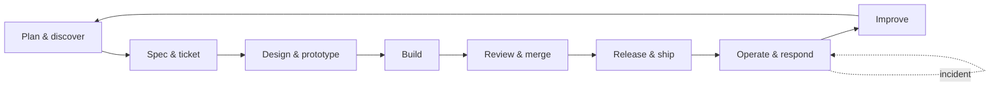

# Workflow

How the 34 skills relate to each other: when to reach for which one, and roughly what order they tend to run in on a real piece of work. This is not a rigid pipeline. Skills that do not apply to a given task are skipped, and the lifecycle loops rather than ending at release.

## The lifecycle at a glance

Nine phases, one loop. Work usually enters at **Plan** (a new idea) or at **Operate** (a bug report, an incident, a backlog item), and `triage` is the hinge that routes backlog work back into `spec-to-tickets`.

## Phase by phase

### 1. Plan & discover

The work is unclear, too big for one sitting, or nobody has agreed yet on what it even is.

| Skill | Reach for it when |
|---|---|
| [`wayfinder`](./skills/wayfinder/SKILL.md) | The work is too large or too foggy to spec in one pass. Stages it as a sequence of individually resolved, recorded decisions. |
| [`grilling`](./skills/grilling/SKILL.md) | A plan has unstated assumptions and the person who can answer is in the room now. Interviews in frontier rounds, closes the known-versus-needed gap. |
| [`to-questionnaire`](./skills/to-questionnaire/SKILL.md) | Same gap as `grilling`, but the answer holder is not reachable live. Produces an async, unbiased written questionnaire instead. |
| [`research`](./skills/research/SKILL.md) | A claim needs verifying against a primary source before anyone relies on it, not a live conversation. |
| [`domain-modeling`](./skills/domain-modeling/SKILL.md) | Vocabulary is inconsistent, or a decision with lasting consequences needs recording. Underlies almost every other skill: most of them point back here for terminology and ADRs. |
| [`triage`](./skills/triage/SKILL.md) | A bug report or feature request just arrived and needs a priority before anyone commits to it. |
| [`project-groundwork`](./skills/project-groundwork/SKILL.md) | A draft spec or README already exists but has contradictions or unresolved TBDs. Scans it against IEEE 29148's quality characteristics, then hands the blocking gaps to `grilling` and the resolved decisions to `domain-modeling`. |

`wayfinder` typically hands off to `grilling`/`to-questionnaire`/`research` for the individual decisions it stages, and everything here writes into `domain-modeling`'s glossary and ADRs as it settles.

### 2. Spec & ticket

The decisions are made. Now they need to become work someone can actually start.

| Skill | Reach for it when |
|---|---|
| [`spec-to-tickets`](./skills/spec-to-tickets/SKILL.md) | An already-discussed plan needs to become a written spec and a set of tracer-bullet tickets, gated by Definition of Ready/Done. |

`spec-to-tickets` synthesizes what Phase 1 already decided; it does not re-run the interview. It pulls in `domain-modeling` for vocabulary and hands each ticket off to `tdd` and `code-review` at the far end.

### 3. Design & prototype

Before code gets written for real, the shape of it gets settled.

| Skill | Reach for it when |
|---|---|
| [`capacity-estimation`](./skills/capacity-estimation/SKILL.md) | A design calls itself fast or scalable without a number, or a pool, queue, or instance count needs sizing. Little's Law turns load into required concurrency before the architecture is picked. |
| [`prototype`](./skills/prototype/SKILL.md) | One specific design or technical question needs answering before committing to an approach. Throwaway code, not production code. |
| [`codebase-design`](./skills/codebase-design/SKILL.md) | A new module or class needs an interface, or an existing one feels shallow. Depth as the metric, the deletion test, designing it twice. |
| [`api-design-standards`](./skills/api-design-standards/SKILL.md) | An API's shape is being decided: resource conventions, versioning, what counts as a breaking change. |
| [`architecture-diagram`](./skills/architecture-diagram/SKILL.md) | The overall structure needs drawing for a reader who cannot assemble it from prose. The C4 model picks the zoom level (context, container, component, code) before anything gets drawn. |

### 4. Build

| Skill | Reach for it when |
|---|---|
| [`tdd`](./skills/tdd/SKILL.md) | Any feature or fix gets built. The red-green-refactor cycle, test-double choice, suite shape. Referenced by nearly every other skill as the default way code gets written. |
| [`secure-coding`](./skills/secure-coding/SKILL.md) | Code crosses a trust boundary: user input, auth, payments, file paths, external commands, third-party dependencies. |
| [`code-style-lint`](./skills/code-style-lint/SKILL.md) | Setting up a project's formatter and enforcement layer, once, not per pull request. |

### 5. Review & merge

| Skill | Reach for it when |
|---|---|
| [`code-review`](./skills/code-review/SKILL.md) | A pull request needs reviewing. The approval bar is "improves code health," code-smell vocabulary instead of vague complaints, style left to `code-style-lint`'s automation. |
| [`resolving-merge-conflicts`](./skills/resolving-merge-conflicts/SKILL.md) | A merge or rebase stops with conflict markers. Trace each side's intent; never blind `--ours`/`--theirs`. |

**Cross-cutting on Build and Review:** [`test-strategy`](./skills/test-strategy/SKILL.md) decides where test data comes from, the flaky-test quarantine policy, and where the integration/e2e boundary actually belongs. It does not repeat `tdd`'s cycle or double taxonomy; the two cross-reference instead of overlapping.

### 6. Release & ship

| Skill | Reach for it when |
|---|---|
| [`release-versioning`](./skills/release-versioning/SKILL.md) | Cutting a release: classifying commits, bumping the version, writing the changelog entry. |
| [`repo-ship`](./skills/repo-ship/SKILL.md) | Commits are being made while work is in progress, or a brand-new repo is being created. Splits commits by intent as they happen; separate from `release-versioning`, which classifies commits already made for a release already shipping. |
| [`safe-deployment`](./skills/safe-deployment/SKILL.md) | A risky change needs a rollout strategy. Decouples deploy from release, defines the rollback trigger before shipping, not during the incident. |
| [`dependency-upgrade-management`](./skills/dependency-upgrade-management/SKILL.md) | A dependency needs upgrading or deprecating: security patches on a fast lane, routine and major upgrades on a slower one, a stated deprecation window. |
| [`repo-secure`](./skills/repo-secure/SKILL.md) | A repo needs its own security settings audited: SECURITY.md, secret scanning, Dependabot, code scanning, branch protection. Scoped to repo configuration, distinct from `secure-coding` (code-level) and `dependency-upgrade-management` (upgrade cadence). |

### 7. Operate & respond

| Skill | Reach for it when |
|---|---|
| [`observability`](./skills/observability/SKILL.md) | A service needs its health made answerable without reading its code: structured logging, the four golden signals, an SLO with alerts that link a runbook. |
| [`incident-response`](./skills/incident-response/SKILL.md) | Something is broken in production right now. Severity and declaration, IC/comms/ops roles, mitigate before root-causing, a blameless postmortem after. |
| [`diagnosing-bugs`](./skills/diagnosing-bugs/SKILL.md) | Something is broken, throwing, or slow and the cause is not yet known. Reproduce reliably, bisect, change one variable at a time. |
| [`handoff`](./skills/handoff/SKILL.md) | Work changes hands mid-flight: an on-call shift ending, an open incident, a session handing off to whoever picks it up next. SBAR structure, closed-loop confirmation. |

This is the only phase that loops on itself: an incident can trigger `diagnosing-bugs`, which can trigger `handoff` to the next shift, without ever leaving Operate.

### 8. Improve

| Skill | Reach for it when |
|---|---|
| [`improve-codebase-architecture`](./skills/improve-codebase-architecture/SKILL.md) | A periodic scan for architectural friction is due. Finds `codebase-design`-style shallow modules, classifies each by Fowler's debt quadrant before recommending anything. |

Findings here that get acted on route back into **Plan** (a fresh `domain-modeling` ADR, sometimes a `wayfinder` map) rather than being fixed inline; findings that get declined for a real reason also get recorded, so the next scan does not re-surface them.

## Cross-cutting communication skills

These do not belong to one phase. They get reached for whenever the situation matches, in any phase:

| Skill | Reach for it when |
|---|---|
| [`teach`](./skills/teach/SKILL.md) | Something needs explaining so it is actually retained, not just told once. Bloom's level, worked-example fading. |
| [`explain-plainly`](./skills/explain-plainly/SKILL.md) | The audience is outside the technical team. Default plain-language posture and a maintained glossary, not a recovery move; separate from `wait-what` below. |
| [`wait-what`](./skills/wait-what/SKILL.md) | The last explanation clearly did not land. Re-pitch with a different framing, never repeat the same one louder. |
| [`writing-for-agents`](./skills/writing-for-agents/SKILL.md) | Writing or editing a skill, `AGENTS.md`, or `CLAUDE.md` itself. Diátaxis, adapted for a document an agent re-reads instead of a human who learns once. |
| [`wizard`](./skills/wizard/SKILL.md) | A procedure needs a human's hands or authority at every step: credentials, an unfamiliar dashboard, a one-off migration. |

## A worked example

A user reports a bug:

1. **`triage`** scores it Impact times Urgency, reproduces it before assigning a priority.
2. If the fix is non-trivial, **`spec-to-tickets`** turns the confirmed bug into a ticket with a stated acceptance outcome.
3. **`diagnosing-bugs`** finds the actual root cause, bisecting rather than guessing.
4. If the fix touches an unclear interface, a quick **`prototype`** answers the one open design question first.
5. **`tdd`** builds the fix test-first, red before green.
6. **`code-review`** checks it against the improve-over-perfect bar.
7. **`release-versioning`** classifies the fix commit and cuts the version bump.
8. **`safe-deployment`** rolls it out behind whatever mechanism the risk warrants.
9. **`observability`**'s alerts confirm the fix actually resolved the underlying signal, not just the report.

If the bug turns out to be a live incident instead of a backlog item, the same tools apply, just under **`incident-response`**'s severity and role structure instead of `triage`'s backlog process, with **`handoff`** carrying it across shift changes.

## Full cross-reference map

Every explicit `` `skill-name` `` reference found inside another skill's own `SKILL.md`, extracted directly from the source rather than asserted:

| Skill | References |
|---|---|
| `api-design-standards` | `dependency-upgrade-management` |
| `architecture-diagram` | `domain-modeling` |
| `capacity-estimation` | `codebase-design`, `domain-modeling`, `grilling`, `incident-response`, `observability`, `project-groundwork`, `safe-deployment` |
| `code-review` | `code-style-lint`, `tdd` |
| `codebase-design` | `code-review`, `tdd` |
| `dependency-upgrade-management` | `safe-deployment`, `secure-coding`, `tdd` |
| `diagnosing-bugs` | `secure-coding`, `tdd` |
| `explain-plainly` | `wait-what` |
| `grilling` | `research` |
| `handoff` | `incident-response` |
| `improve-codebase-architecture` | `codebase-design`, `domain-modeling` |
| `incident-response` | `diagnosing-bugs`, `observability`, `safe-deployment` |
| `observability` | `diagnosing-bugs`, `secure-coding` |
| `project-groundwork` | `domain-modeling`, `grilling`, `wayfinder` |
| `repo-secure` | `dependency-upgrade-management`, `secure-coding` |
| `repo-ship` | `release-versioning` |
| `resolving-merge-conflicts` | `tdd` |
| `safe-deployment` | `observability` |
| `secure-coding` | `diagnosing-bugs` |
| `spec-to-tickets` | `code-review`, `domain-modeling`, `tdd` |
| `test-strategy` | `api-design-standards`, `diagnosing-bugs`, `tdd` |
| `triage` | `incident-response`, `spec-to-tickets` |
| `wait-what` | `domain-modeling` |
| `wayfinder` | `domain-modeling`, `spec-to-tickets` |
| `writing-for-agents` | `domain-modeling` |

`domain-modeling` and `tdd` are the two most-referenced skills; almost everything either records a decision into the former or builds through the latter.
