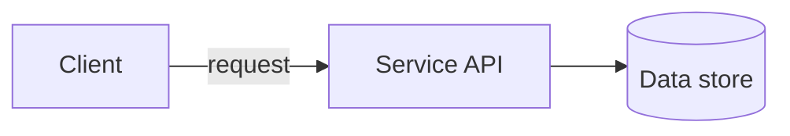

# Architecture Diagram

A diagram that tries to show everything at once tells a reader nothing; a diagram at the wrong zoom level either overwhelms a newcomer with detail or says nothing useful to someone who already knows the codebase. This skill's defining constraint, from Simon Brown's C4 model: pick the zoom level the audience actually needs before drawing anything, since context, container, component, and code answer different questions and mixing them in one diagram answers none of them well.

## Phase 1: Find the mechanism and the level

Before touching a diagram tool, identify what a cold reader would otherwise have to assemble from prose: which parts talk to which, across what boundary, carrying what; or a decision or write path where a design principle hinges on a specific branch (an approval gate, a conflict check, a fallback). A diagram that draws every directory in the repo as a box is decoration, not documentation; skip it.

Then pick the C4 level that matches the question:

- **Context**: the system as one box, its users, and the other systems it talks to. For someone who has never seen this project before.
- **Container**: the major applications, services, APIs, and data stores that make up the system, and how they call each other. For someone about to work in the codebase.
- **Component**: how one container breaks down internally. For someone about to change that specific container.
- **Code**: classes and functions. Rarely worth a standing diagram; usually better left to the code itself and drawn ad hoc only when a specific structure needs explaining.

Most requests want Container; Context is for onboarding docs, Component is for a deep dive into one subsystem.

## Phase 2: Draw with consistent notation

Boxes are the things (systems, containers, components); arrows are the relationships, each one labeled with what actually crosses it and its direction. A box without a label, or an arrow that just says "uses," is a placeholder, not a finished diagram. Use the project's own domain vocabulary for box names (see `domain-modeling`'s ubiquitous language) rather than internal class or file names a reader outside the codebase would not recognize.

## Phase 3: Commit as diagram as code, not an exported image

Write the diagram in a text format the repo's host renders natively (a Mermaid fence in a Markdown file is the most portable choice: GitHub, GitLab, and most modern doc tooling render it directly, and it swaps colors automatically for the viewer's light or dark theme). Do not export a static image and paste it in; a static image goes stale the moment the architecture changes and nobody remembers to regenerate it, and it usually carries hardcoded colors that render wrong in whichever theme it was not designed for.

Practical notes: a decision point becomes a diamond node with its branches as labeled edges; a deferred or not-yet-built path becomes a dashed edge rather than a color choice; keep node labels to a few words and put the explaining sentence in the surrounding prose, not crammed into the node.

## Phase 4: Write the surrounding doc

Give each diagram: one or two sentences of setup naming what it is about to show and why it matters, the diagram itself, and a short caption naming the one claim the diagram makes rather than restating its boxes in prose. Place it in `docs/architecture.md` or the README for a small project, and link it from the README if it lives elsewhere.

## Phase 5: Update on structural change, not on every commit

A diagram that gets regenerated every time it is opened stays accurate but wastes effort; a diagram nobody revisits goes stale silently. Update it when a container is added or removed, a major dependency direction changes, or a decision path the diagram depicts gets replaced, not on routine code changes that do not alter the shape being drawn.

## Done when

- [ ] The C4 level matches the audience's actual question, not defaulted to whatever is easiest to draw.
- [ ] Every box and arrow is labeled with what it actually is and what actually crosses it.
- [ ] The diagram is committed as text (Mermaid or an equivalent diagram-as-code format), not as a static exported image.
- [ ] The surrounding doc states what the diagram shows and the one claim it makes, not just the diagram alone.
- [ ] The diagram is revisited on structural change, not left to go stale or regenerated on every unrelated commit.
